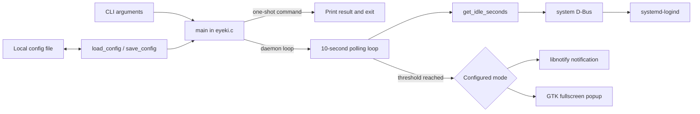
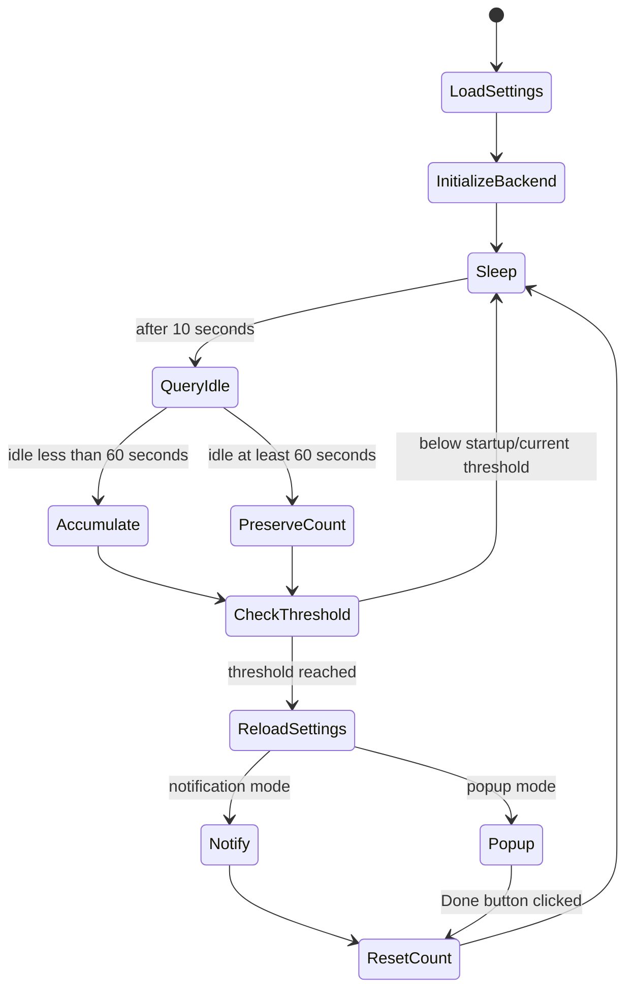

# Architecture

## Overview

EyeKi is a single-threaded Linux desktop process. Nearly all behavior lives in `eyeki.c`; configuration types and function bodies live in `config.h`. It has no IPC server, database, network client, plugin system, or background worker.

## Modules and responsibilities

| Location | Responsibility | Important limitations |
| --- | --- | --- |
| `main()` in `eyeki.c` | Parse CLI, initialize one UI backend, accumulate active time, reload settings at a trigger, dispatch reminders | Infinite foreground loop; wall-clock timing; backend initialization and reload can disagree |
| `get_idle_seconds()` | Open system bus, list logind sessions, query idle properties | Always uses first session; recreates bus connection every poll; errors become “active” |
| `send_notification()` | Initialize libnotify lazily and request a ten-second notification | Return values/errors ignored; hard-coded message |
| `show_popup()` and callback | Build fullscreen window and block in a manual GTK event loop until button click | Window-manager close is not handled; global mutable state; compositor-dependent |
| `config.h` | Define `Config`, defaults, parse and overwrite the config file | Header contains external function definitions; no validation, XDG support, atomic write, or error reporting |
| `Makefile` | Compile with GTK/libnotify/libsystemd; install binary and unit | No debug/test/lint/package targets |
| `eyeki.service` | Run `/usr/bin/eyeki --daemon` as a user service and restart failures | Fixed installed path; no hardening or graphical-session binding beyond ordering |
| `debian/` | Preliminary Debian source-package metadata | Unverified, incomplete, and version/attribution review required |

## Application lifecycle

1. `main()` calls `load_config()`. Missing/unreadable configuration silently produces defaults.
2. Arguments are processed left-to-right.
   - A recognized setting command writes the complete configuration, prints success regardless of write outcome, and exits.
   - `--show-config` prints the loaded values and exits.
   - `--help` prints usage and exits.
   - `--daemon` is a no-op marker; no arguments behave identically.
   - Unknown or incomplete options print an error/usage and exit nonzero.
3. Popup startup calls `gtk_init`; notification startup calls `notify_init` without checking success.
4. The process logs its interval/mode to stderr and enters the reminder loop.
5. The loop ends only through external process termination or a fatal library failure.

## Reminder and timer lifecycle

`elapsed = time(NULL) - last_check` is accumulated, so clock changes can make it negative or unexpectedly large. Idle time pauses but does not reset progress. Settings are reloaded only after comparison with the previously loaded interval, so shortening an interval is not immediately observed.

## Idle detection

Every poll creates a system-bus connection and calls logind `ListSessions`. The code reads only the first `(session id, uid, username, seat, object path)` record. It then queries that session's `IdleHint`; if true, it reads `IdleSinceHint` and subtracts it from the current realtime clock.

This does not establish that the chosen session belongs to the process owner, seat, or active graphical session. Empty results and D-Bus/property errors return zero, which the scheduler interprets as activity. A future implementation should resolve the current session explicitly, reuse connections where appropriate, distinguish unknown from active, and use bounded monotonic durations.

## Popup and notification flow

Notification mode creates `NotifyNotification`, sets normal urgency and a requested 10,000 ms timeout, shows it, and unreferences it. Notification servers may ignore the timeout. EyeKi neither requests permission nor reports rejection/failure.

Popup mode creates an undecorated fullscreen, keep-above `GtkWindow`, places Persian labels and a button over a dark background, then pumps GTK events every 50 ms. Only the button callback changes `popup_dismissed`; a window-manager close can leave the loop alive. Focus, stacking, fullscreen, and multi-monitor behavior are not verified and can vary by compositor.

Runtime mode changes are fragile: if the process started in notification mode and reloads popup mode at a trigger, it calls GTK functions without prior `gtk_init`. Until fixed, restart the process after changing mode.

## Configuration and persistence flow

The default is `interval_minutes = 60`, `MODE_POPUP`. `load_config()` starts from defaults, parses recognized lines, ignores unknown keys, uses `atoi` for interval, and maps every non-`popup` mode string to notification. There is no malformed-value or bounds detection.

`save_config()` builds paths from `HOME`, attempts to create only `$HOME/.config/eye_reminder`, and overwrites `config`. If `$HOME/.config` does not exist, saving fails silently. File mode depends on process umask; directory creation requests `0755`. Writes are not atomic and concurrent one-shot updates can overwrite each other.

## Error handling and logging

The prevailing strategy is silent fallback:

- Configuration and path failures use defaults or return without reporting.
- D-Bus errors return “not idle.”
- libnotify initialization/show results and GTK CSS errors are ignored.
- Only invalid CLI input has explicit nonzero exits.
- Startup logs interval and mode to stderr; a systemd service records this in the user journal.

Future boundaries should return structured status values and make user-actionable failures visible without repeating sensitive session details.

## Platform integration and dependencies

| Dependency/integration | Used for |
| --- | --- |
| C/POSIX and libc | Process, sleep, time, filesystem, environment |
| libsystemd `sd-bus` | system D-Bus and logind idle properties |
| GTK 3 / GLib / GDK | Fullscreen popup and event processing |
| libnotify | Desktop notification protocol client |
| systemd user manager | Optional startup/supervision through `eyeki.service` |
| Desktop notification service | Actual display and policy for notifications |
| X11 or Wayland GTK backend | Popup rendering; behavior not verified across either |

No direct network or remote service dependency exists in the source.

## Recommended future boundaries

1. **Configuration:** pure parsing/validation model plus platform path and atomic storage adapters.
2. **Scheduler:** monotonic time and explicit events (`active`, `idle`, `unknown`, `settings changed`) independent of D-Bus/GTK.
3. **Activity provider:** Linux logind implementation that selects the correct session and exposes errors.
4. **Presentation:** notification and popup interfaces initialized independently, with accessible lifecycle/error contracts.
5. **Application/service:** CLI, process signals, live reload policy, logging, and dependency wiring.

These boundaries enable unit testing without a desktop or system bus and keep future platform ports from leaking into core scheduling.
