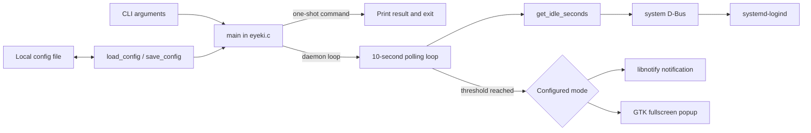

# Architecture

## Overview

EyeKi is a single-threaded Linux desktop process. CLI, activity lookup, and presentation still live in `eyeki.c`; configuration persistence and scheduling are separate C modules. It has no IPC server, database, network client, plugin system, or background worker.

## Modules and responsibilities

| Location | Responsibility | Important limitations |
| --- | --- | --- |
| `main()` in `eyeki.c` | Parse CLI, initialize one UI backend, sample activity, reload settings at a trigger, dispatch reminders | Infinite foreground loop; backend initialization and reload can disagree |
| `get_idle_seconds()` | Open system bus, list logind sessions, query idle properties | Always uses first session; recreates bus connection every poll; errors become “active” |
| `send_notification()` | Initialize libnotify lazily and request a ten-second notification | Return values/errors ignored; hard-coded message |
| `show_popup()` and callback | Build fullscreen window and block in a manual GTK event loop until button click | Window-manager close is not handled; global mutable state; compositor-dependent |
| `config.c` / `config.h` | Define `Config`, defaults, strict interval parsing/conversion, XDG/legacy selection, and private atomic saving | Mode parsing is permissive; read/parse errors are silent; concurrent complete-config updates can lose fields |
| `scheduler.c` / `scheduler.h` | Accumulate monotonic active time, reset on idle/unknown state, and report threshold crossing | Receives ten-second samples; immediate config-change observation is not implemented |
| `Makefile` | Compile with GTK/libnotify/libsystemd; run desktop-independent unit tests; install binary and unit | No debug/lint/package targets |
| `eyeki.service` | Run `/usr/bin/eyeki --daemon` as a user service and restart failures | Fixed installed path; no hardening or graphical-session binding beyond ordering |
| `debian/` | Preliminary Debian source-package metadata | Unverified, incomplete, and version/attribution review required |

## Application lifecycle

1. `main()` calls `load_config()`. Missing/unreadable configuration silently produces defaults.
2. Arguments are processed left-to-right.
   - A recognized setting command validates interval input when applicable, atomically writes the complete configuration, and prints success only when the save succeeds. Save failures print a system error and exit nonzero.
   - `--show-config` prints the loaded values and exits.
   - `--help` prints usage and exits.
   - `--daemon` is a no-op marker; no arguments behave identically.
   - Unknown or incomplete options print an error/usage and exit nonzero.
3. Popup startup calls `gtk_init`; notification startup calls `notify_init` without checking success.
4. The process logs its interval/mode to stderr and enters the reminder loop.
5. The loop ends only through external process termination or a fatal library failure.

## Reminder and timer lifecycle

The extracted scheduler accumulates differences between `CLOCK_MONOTONIC` samples. Idle or unknown activity state resets progress to zero. Settings are still reloaded only after comparison with the previously loaded interval, so changes are not immediately observed.

## Idle detection

Every poll creates a system-bus connection and calls logind `ListSessions`. The code reads only the first `(session id, uid, username, seat, object path)` record. It then queries that session's `IdleHint`; if true, it reads `IdleSinceHintMonotonic` and subtracts it from the current monotonic clock.

This does not establish that the chosen session belongs to the process owner, seat, or active graphical session. Empty results and D-Bus/property errors produce an unknown activity state, which resets the scheduler and emits one diagnostic per failure/recovery period. A future implementation should resolve the current session explicitly and reuse or subscribe through a persistent connection.

## Popup and notification flow

Notification mode creates `NotifyNotification`, sets normal urgency and a requested 10,000 ms timeout, shows it, and unreferences it. Notification servers may ignore the timeout. EyeKi neither requests permission nor reports rejection/failure.

Popup mode creates an undecorated fullscreen, keep-above `GtkWindow`, places Persian labels and a button over a dark background, then pumps GTK events every 50 ms. Only the button callback changes `popup_dismissed`; a window-manager close can leave the loop alive. Focus, stacking, fullscreen, and multi-monitor behavior are not verified and can vary by compositor.

Runtime mode changes are fragile: if the process started in notification mode and reloads popup mode at a trigger, it calls GTK functions without prior `gtk_init`. Until fixed, restart the process after changing mode.

## Configuration and persistence flow

The default is `interval_minutes = 60`, `MODE_POPUP`. Interval values must contain only decimal digits and fall within the inclusive 10–300 minute production range. CLI values that fail validation exit nonzero before saving; persisted invalid interval values are ignored rather than replacing the default or a preceding valid value. A checked conversion produces scheduler seconds after validating the range, while scheduler tests can inject shorter durations directly. `load_config()` ignores unknown keys and still maps every non-`popup` mode string to notification without diagnosing malformed modes.

An absolute, non-empty `XDG_CONFIG_HOME` selects `$XDG_CONFIG_HOME/eye_reminder/config`; otherwise the path is `$HOME/.config/eye_reminder/config`. Relative XDG overrides are ignored. When the XDG file is absent, `load_config()` reads the legacy HOME path without modifying it. A later successful setting change writes only the XDG path, providing a non-destructive migration.

`save_config()` safely walks and creates missing parent directories without following symlinked directory components. Newly created parents and the EyeKi directory use owner-only access; an existing EyeKi directory is tightened to `0700`. It writes the full configuration to an exclusive `0600` temporary file, flushes and syncs it, atomically renames it to `config`, and syncs the directory. Concurrent one-shot processes can still load the same old configuration and replace one another's field updates; service-aware coordination remains separate work.

## Error handling and logging

The prevailing strategy is silent fallback:

- Invalid persisted intervals use the default without reporting; configuration path/read failures also use defaults.
- D-Bus errors return “not idle.”
- libnotify initialization/show results and GTK CSS errors are ignored.
- Invalid CLI input and configuration-save failures have explicit nonzero exits.
- Startup logs interval and mode to stderr; a systemd service records this in the user journal.

Future boundaries should return structured status values and make user-actionable failures visible without repeating sensitive session details.

## Platform integration and dependencies

| Dependency/integration | Used for |
| --- | --- |
| C/POSIX and libc | Process, sleep, time, filesystem, environment |
| libsystemd `sd-bus` | system D-Bus and logind idle properties |
| GTK 3 / GLib / GDK | Fullscreen popup and event processing |
| libnotify | Desktop notification protocol client |
| systemd user manager | Optional startup/supervision through `eyeki.service` |
| Desktop notification service | Actual display and policy for notifications |
| X11 or Wayland GTK backend | Popup rendering; behavior not verified across either |

No direct network or remote service dependency exists in the source.

## Recommended future boundaries

1. **Configuration:** pure parsing/validation model plus platform path and atomic storage adapters.
2. **Scheduler:** monotonic time and explicit events (`active`, `idle`, `unknown`, `settings changed`) independent of D-Bus/GTK.
3. **Activity provider:** Linux logind implementation that selects the correct session and exposes errors.
4. **Presentation:** notification and popup interfaces initialized independently, with accessible lifecycle/error contracts.
5. **Application/service:** CLI, process signals, live reload policy, logging, and dependency wiring.

These boundaries enable unit testing without a desktop or system bus and keep future platform ports from leaking into core scheduling.
