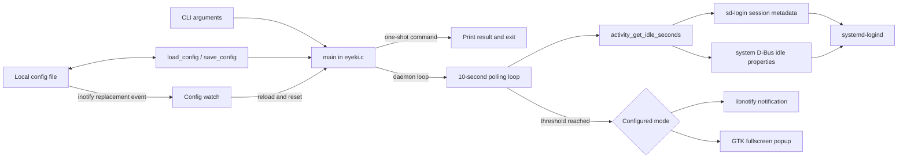
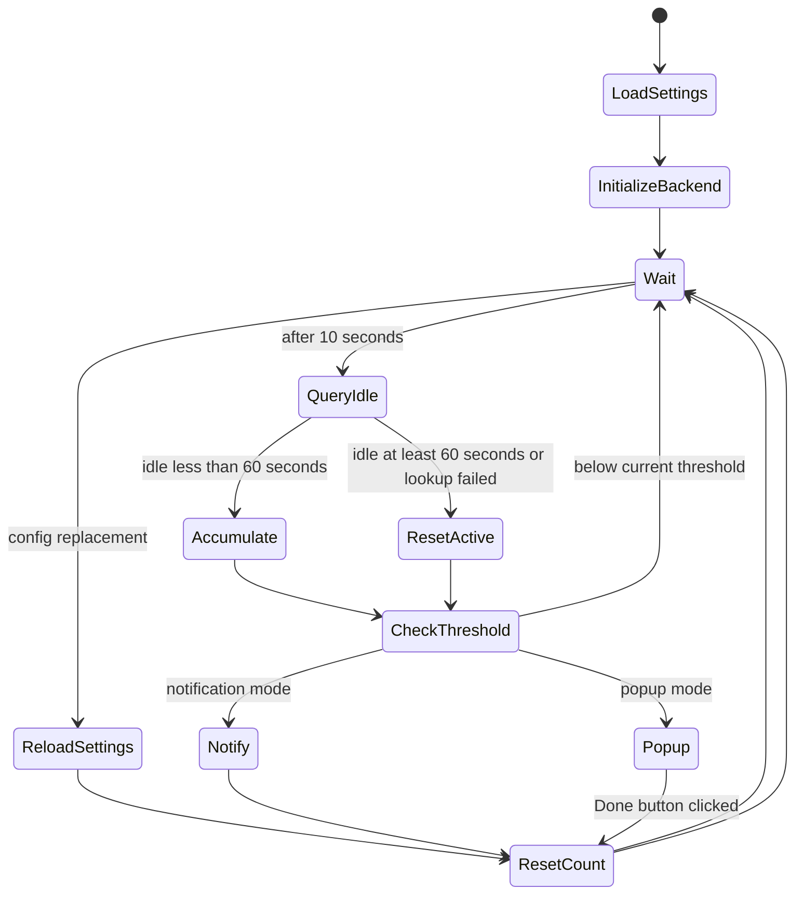

# Architecture

## Overview

EyeKi is a single-threaded Linux desktop process. CLI, activity lookup, and presentation still live in `eyeki.c`; configuration persistence and scheduling are separate C modules. It has no IPC server, database, network client, plugin system, or background worker.

## Modules and responsibilities

| Location | Responsibility | Important limitations |
| --- | --- | --- |
| `main()` in `eyeki.c` | Parse CLI, initialize one UI backend, poll activity and configuration events, dispatch reminders | Infinite foreground loop; backend initialization and reload can disagree |
| `activity.c` / `activity.h` | Resolve the current user's eligible logind session and query its monotonic idle properties | Recreates a system-bus connection every poll; depends on accurate logind metadata |
| `activity_selection.c` / `activity_selection.h` | Apply deterministic ownership, graphical-session, and multi-session policy behind an injectable API | Rejects ambiguity when neither a process session nor primary display identifies one candidate |
| `send_notification()` | Initialize libnotify lazily and request a ten-second notification | Return values/errors ignored; hard-coded message |
| `show_popup()` and callback | Build fullscreen window and block in a manual GTK event loop until button click | Window-manager close is not handled; global mutable state; compositor-dependent |
| `config.c` / `config.h` | Define `Config`, defaults, strict interval parsing/conversion, XDG/legacy selection, and private atomic saving | Mode parsing is permissive; read/parse errors are silent; concurrent complete-config updates can lose fields |
| `config_watch.c` / `config_watch.h` | Observe the selected primary config path and its nearest existing parent with Linux inotify | Coalesces rapid replacements into the latest complete configuration |
| `runtime.c` / `runtime.h` | Install a complete configuration with its monotonic scheduler state and reset elapsed time on reload | Presentation-backend readiness remains outside this boundary |
| `scheduler.c` / `scheduler.h` | Accumulate monotonic active time, reset on idle/unknown state, and report threshold crossing | Receives ten-second activity samples |
| `Makefile` | Compile with GTK/libnotify/libsystemd; run desktop-independent unit tests; install binary and unit | No debug/lint/package targets |
| `eyeki.service` | Run `/usr/bin/eyeki --daemon` as a user service and restart failures | Fixed installed path; no hardening or graphical-session binding beyond ordering |
| `debian/` | Preliminary Debian source-package metadata | Unverified, incomplete, and version/attribution review required |

## Application lifecycle

1. `main()` calls `load_config()`. Missing/unreadable configuration silently produces defaults.
2. Arguments are processed left-to-right.
   - A recognized setting command validates interval input when applicable, atomically writes the complete configuration, and prints success only when the save succeeds. Save failures print a system error and exit nonzero.
   - `--show-config` prints the loaded values and exits.
   - `--help` prints usage and exits.
   - `--daemon` is a no-op marker; no arguments behave identically.
   - Unknown or incomplete options print an error/usage and exit nonzero.
3. Daemon startup creates an inotify watch for the primary configuration path, reloads once to close the load/watch race, and installs the complete configuration in runtime state.
4. Popup startup calls `gtk_init`; notification startup calls `notify_init` without checking success.
5. The process logs its interval/mode to stderr and enters the reminder loop.
6. The loop ends only through external process termination or a fatal library failure.

## Reminder and timer lifecycle

The extracted scheduler accumulates differences between `CLOCK_MONOTONIC` samples. Idle or unknown activity state resets progress to zero. The daemon polls the inotify descriptor until the next ten-second activity deadline, so an atomic settings replacement wakes it without waiting for either the activity poll or old reminder threshold. Runtime reload validates and installs the complete configuration together, resets active time at the reload's monotonic timestamp, and continues counting from there. Multiple replacements already queued when the daemon wakes are coalesced into the latest complete configuration.

## Idle detection

Every poll resolves a session for EyeKi's effective UID through libsystemd's `sd-login` interface. If the process belongs to a login session, that session is authoritative and must itself be active, local, graphical (`x11`, `wayland`, or `mir`), user-class, and owned by the effective UID. A systemd user service normally has no process session, so EyeKi enumerates only active sessions for its UID, prefers logind's primary display session when eligible, accepts a sole eligible fallback, and rejects multiple eligible sessions as ambiguous rather than depending on enumeration order.

After selection, EyeKi opens the system bus, resolves only that session's object path, and queries `IdleHint`. When idle, it reads `IdleSinceHintMonotonic` and subtracts it from `CLOCK_MONOTONIC`. Missing eligible sessions, ambiguous candidates, and integration/property errors are distinct lookup results. All reset scheduler progress as unknown activity, and stderr reports only transitions between these states or recovery without logging UIDs or session identifiers.

## Popup and notification flow

Notification mode creates `NotifyNotification`, sets normal urgency and a requested 10,000 ms timeout, shows it, and unreferences it. Notification servers may ignore the timeout. EyeKi neither requests permission nor reports rejection/failure.

Popup mode creates an undecorated fullscreen, keep-above `GtkWindow`, places Persian labels and a button over a dark background, then pumps GTK events every 50 ms. Only the button callback changes `popup_dismissed`; a window-manager close can leave the loop alive. Focus, stacking, fullscreen, and multi-monitor behavior are not verified and can vary by compositor.

Runtime mode changes are fragile: if the process started in notification mode and reloads popup mode, the next reminder calls GTK functions without prior `gtk_init`. Until fixed, restart the process after switching into popup mode.

## Configuration and persistence flow

The default is `interval_minutes = 60`, `MODE_POPUP`. Interval values must contain only decimal digits and fall within the inclusive 10–300 minute production range. CLI values that fail validation exit nonzero before saving; persisted invalid interval values are ignored rather than replacing the default or a preceding valid value. A checked conversion produces scheduler seconds after validating the range, while scheduler tests can inject shorter durations directly. `load_config()` ignores unknown keys and still maps every non-`popup` mode string to notification without diagnosing malformed modes.

An absolute, non-empty `XDG_CONFIG_HOME` selects `$XDG_CONFIG_HOME/eye_reminder/config`; otherwise the path is `$HOME/.config/eye_reminder/config`. Relative XDG overrides are ignored. When the XDG file is absent, `load_config()` reads the legacy HOME path without modifying it. A later successful setting change writes only the XDG path, providing a non-destructive migration.

The daemon watches that selected primary path. If its parent directories do not exist yet, it watches the nearest existing ancestor and moves the watch inward after creation events. Atomic rename gives each successful settings command a distinct file identity, including commands that save values identical to the current configuration. Deleting or replacing the file is also observed. The popup's manual GTK loop checks the same inotify descriptor every 50 milliseconds, so an open acknowledgement window does not defer a configuration reload.

`save_config()` safely walks and creates missing parent directories without following symlinked directory components. Newly created parents and the EyeKi directory use owner-only access; an existing EyeKi directory is tightened to `0700`. It writes the full configuration to an exclusive `0600` temporary file, flushes and syncs it, atomically renames it to `config`, and syncs the directory. Concurrent one-shot processes can still load the same old configuration and replace one another's field updates; service-aware coordination remains separate work.

## Error handling and logging

The prevailing strategy is silent fallback:

- Invalid persisted intervals use the default without reporting; configuration path/read failures also use defaults.
- Missing, ambiguous, and failed session/idle lookups return distinct unknown states that reset active time.
- libnotify initialization/show results and GTK CSS errors are ignored.
- Invalid CLI input and configuration-save failures have explicit nonzero exits.
- Startup logs interval and mode to stderr; a systemd service records this in the user journal.

Future boundaries should return structured status values and make user-actionable failures visible without repeating sensitive session details.

## Platform integration and dependencies

| Dependency/integration | Used for |
| --- | --- |
| C/POSIX and libc | Process, sleep, time, filesystem, environment |
| libsystemd `sd-login` / `sd-bus` | Current-user session metadata and system D-Bus idle properties |
| GTK 3 / GLib / GDK | Fullscreen popup and event processing |
| libnotify | Desktop notification protocol client |
| systemd user manager | Optional startup/supervision through `eyeki.service` |
| Desktop notification service | Actual display and policy for notifications |
| X11 or Wayland GTK backend | Popup rendering; behavior not verified across either |

No direct network or remote service dependency exists in the source.

## Recommended future boundaries

1. **Configuration:** pure parsing/validation model plus platform path and atomic storage adapters.
2. **Scheduler/runtime:** monotonic time and explicit events (`active`, `idle`, `unknown`, `settings changed`) independent of D-Bus/GTK.
3. **Activity provider:** extracted Linux logind implementation with deterministic session selection; a future persistent connection/monitor can replace per-poll synchronous lookups behind this boundary.
4. **Presentation:** notification and popup interfaces initialized independently, with accessible lifecycle/error contracts.
5. **Application/service:** CLI, process signals, live reload policy, logging, and dependency wiring.

These boundaries enable unit testing without a desktop or system bus and keep future platform ports from leaking into core scheduling.
